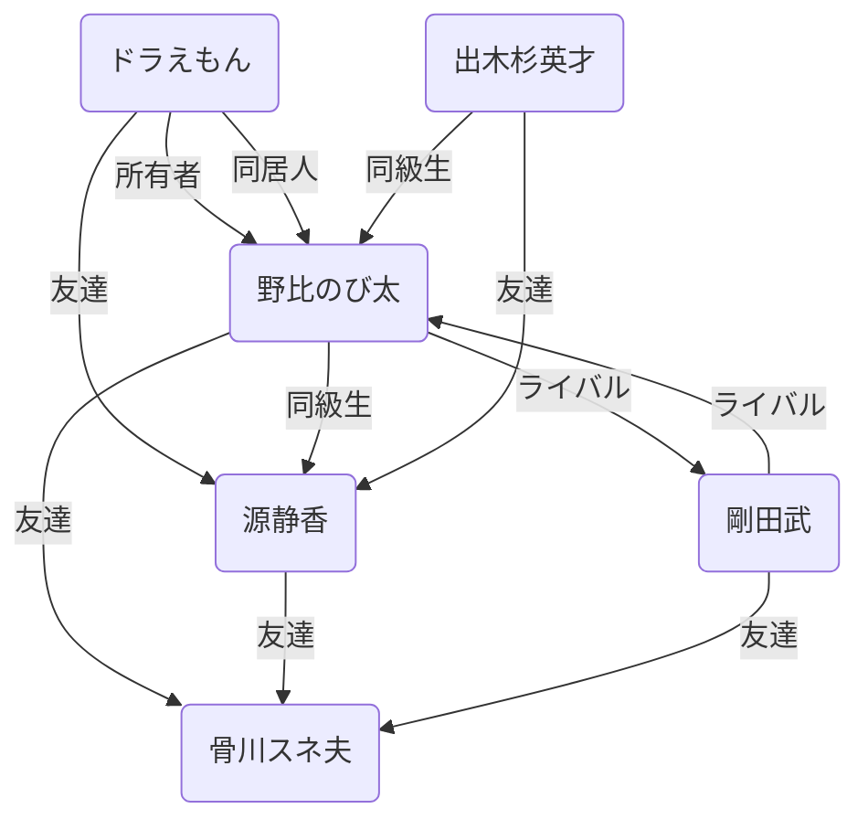

```mermaid
graph TD;
  Doraemon(ドラえもん) -- "所有者" --> NobiNobita(野比のび太)
  Doraemon -- "同居人" --> NobiNobita
  Doraemon -- "友達" --> MinamotoShizuka(源静香)
  NobiNobita -- "同級生" --> MinamotoShizuka
  NobiNobita -- "ライバル" --> GoudaTakeshi(剛田武)
  NobiNobita -- "友達" --> HonekawaSuneo(骨川スネ夫)
  GoudaTakeshi -- "ライバル" --> NobiNobita
  MinamotoShizuka -- "友達" --> HonekawaSuneo
  GoudaTakeshi -- "友達" --> HonekawaSuneo
  DekisugiHidetoshi(出木杉英才) -- "同級生" --> NobiNobita
  DekisugiHidetoshi -- "友達" --> MinamotoShizuka
```